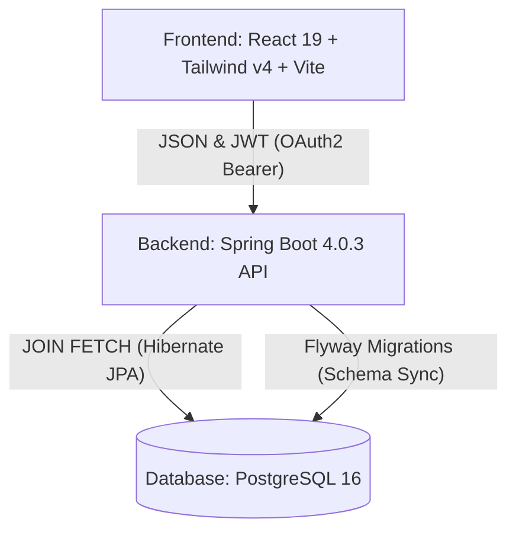

# Topologia e Arquitetura do Sistema

## 🗺️ Arquitetura Macro
O ecossistema do Qronis é projetado para escalabilidade lateral horizontal. Operamos com um modelo **SPA (Single Page Application)** consumindo de uma **REST API** totalmente stateless.



## 📁 Árvore de Diretórios Esperada (Folder Tree)
```plaintext
qronis/
├── build.gradle.kts          # Entrypoint do build Java
├── docker-compose.yml        # Infra local (PostgreSQL)
├── context/                  # Contexto antigo/legado
├── docs/                     # Repositório de Specs Técnicas
│   ├── context.md           # Visão de Produto e Regras    
│   ├── rules.md              # Leis da Arquitetura
│   ├── plan.md               # Você está aqui
│   ├── api.md                # Desenho dos Endpoints
│   ├── tasks.md              # Planejamento atual
│   └── memories.md           # ADRs (Decisões de Longo Prazo)
├── postman/                  # Postman colletions
│   └── Qronis_API.postman_collection.json
├── src/
│   ├── main/
│   │   ├── java/com/qronis/
│   │   │   ├── config/       # Spring Security Chains, Mappers
│   │   │   ├── controller/   # Entrypoints REST API
│   │   │   ├── dto/          # Java Records para I/O
│   │   │   ├── entity/       # Models do banco
│   │   │   ├── exception/    # Controller Advices (Throwables)
│   │   │   ├── mapper/       # Declarações do MapStruct
│   │   │   ├── repository/   # JPA Interfaces e Queries custom
│   │   │   ├── security/     # JWT Decoding e Context Holders
│   │   │   └── service/      # Business Logic Rules
│   │   └── resources/
│   │       ├── db/migration/ # Flyway SQL Scripts
│   │       └── application.yml
│   └── test/                 # Testes unitários (Mockito) e Integração (Testcontainers)
└── frontend/                 # Workspace React/Vite UI
```

## 🧩 Entidades Principais (Core Entities)
Com base na análise relacional e scripts do banco (Flyway), a estrutura lógica se divide nas seguintes instâncias primárias herdando dados base de controle via `BaseEntity` (id, createdAt, updatedAt):

### `Tenant`
Representa um Work-space ou conta de companhia. Todas as entidades geradas ficam ilhadas sob ele.

### `User`
O detentor da credencial e informações globais vitaiscis. Possui `email` único e um `password` encriptado em hash.

### `TenantUser` (Pivot Link)
Relação de elo fraco para modelar acessos multi-contas. Entidade que detém a PK composta (ligando o `User` ao `Tenant`) e que embute as Claims de RBAC (`Role` no nível de negócio da tenant, ex: `OWNER`, `MEMBER`).

### `Project`
Subconjunto taxonômico para agregar o rastreamento cronometrado. Pertence sempre e estritamente a um `Tenant` pai. Documenta o criador (`User` via vínculo FK).

### `TimeEntry`
O pulmão transacional do produto.
- Liga-se a um `Project`.
- Pertence a um `User` (o obreiro).
- É blindado por constraints contra sobreposições (Apenas um registro pode ter `end_time` igual a `NULL` para um respectivo escopo de dono).

## 🛡️ Contratos Padronizados

### Transferência de Dados (DTOs)
As mutações inter-sistemas acontecem em formato blindado através de Java Records imutáveis. Validações semânticas da JSR-380 (`@NotNull`, `@NotBlank`) são executadas no momento do deserializer antes do Controller processar a lógica. 

### Tratamento de Falhas (ErrorResponseDTO)
O `GlobalExceptionHandler` intercepta exceções garantindo uma topologia HTTP determinística.
```json
{
  "status": 400,
  "message": "Erro de validação",
  "errors": {
    "startTime": "Horário de início é obrigatório",
    "projectId": "ID do projeto é obrigatório"
  }
}
```
